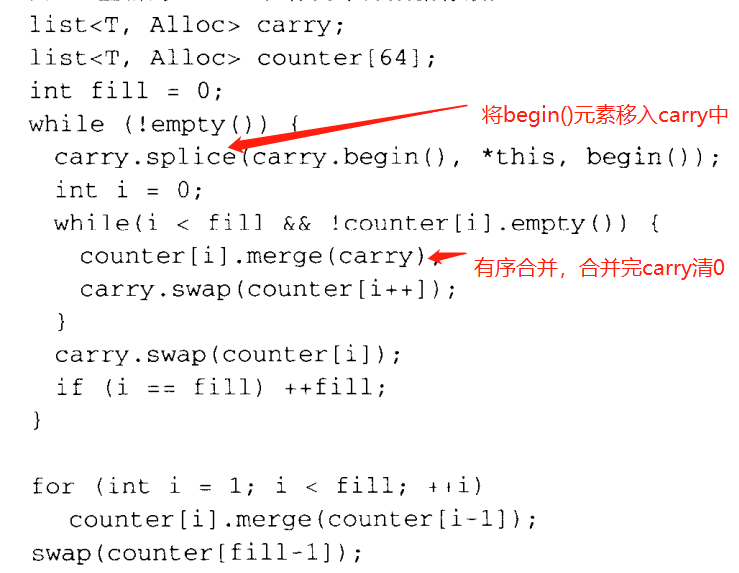

**注：此书使用的STL以及C++版本过早，因此阅读时对代码未有过多阅读或者细究，主要是看STL设计的思路结构**

### 第二章：空间配置器

- 析构是一件花时间的事情，C++中一般会通过type traits对类型做判断，决定是否调用析构处理函数，一般POD型就无需处理。

- 其中的 allocate 内存空间分配器设计值得参考

  - allocate是分配空间，硬盘、内存等存储介质都可以（这里有个疑问，怎么将内存空间的访问和硬盘空间的访问操作等同？还是说特化处理？）

  - 分一、二级

    - 一级主管大空间的申请管理

    - 二级主管小空间的申请，这里是<=128bytes的空间申请。

      内存池做为二级分配器的整块空间池。然后其维护了多个链表，例如链表0维护了数个空间大小为8bytes的小空闲空间，链表1是16bytes，以此类推，以8为倍数。这里可以看出，二级分配器会自动把非8倍数的小空间申请，上调至8的倍数。

      当链表中的空间不足时，会去向内存池申请一定数量的内存，内存池会尽可能返回满足申请要求的空间大小。

      当内存池不足时，首先会像heap空间申请，若申请不到，则从满足空间大小的其余链表中取出一个空闲块返回给需要的链表。如若还无法申请到，则会调用一级配置器（有更好的处理机制？）

      这里有个有意思的操作，<u>每个链表节点其实就是完整的数据空间，指向下一个数据块的指针，存在自身的空间中，而不是另开空间。</u>

    - 自己瞎写：~~这玩意儿似乎有个小bug，就是使用时间长了，容易造成链表中的节点向小空间倾斜？~~  ~~还有就是，小空间的数据使用被释放后，是否还会归还到二级分配器中？~~答：没必要，归还会导致链表膨胀。 

      有了，小bug！每次内存池空间不足时，会把零头分给适当链表，然后向heap申请，这个零头吧，要是每次都落在一个链表上，就有问题了，这里是真膨胀了。

- 有几个全局的未初始化空间初始化函数，它们的特点就是对POD型数据类型、char\*、wchar_t\*特化处理，提高处理效率。同时，有一个准则要注意，就是若初始化空间中的一个元素失败，所有已经初始化好的空间需要回撤，也就是要析构。 要么全部初始化好，要么全没好。

### 第三章 迭代器概念与traits编程技法

- 这里有个不错的思想，如果将迭代器作为脱离于类型的设计，会发现对于不同的数据结构其需要将自己的很多信息暴露给迭代器，也就是说对指定数据结构的迭代器来说，本身需要知道许多关于该数据结构的实现细节信息。因此，迭代器应该是交由数据结构容器的实现者来实现，而非作为一个独立设计。

- ？？？iterator_traits\<T\>::difference_type 不是很懂源码的意思？？？

- 小技巧：函数得形参不写参数名也是可以的，在利用模板实现编译期if-else语法时就很好用

- iterator_traits中有个消除函数单纯传递调用的小思想，可以参考借鉴一下，举例代码如下：

  ```C++
  struct typeA {};
  struct typeB : public typeA{};
  void func(typeA& a);
  void func(typeB& b) { 
  	func(typeA(b));     //单纯的传递调用
  }
  
  template<class T>
  void func(T t, typeA)   //可以解决
  {
      cout << "hello" << endl;
  }
  //注意：这个例子主要还是传递一个思想，例子本身似乎不合理
  ```

- 通过iterator_traits、types_traits本质上是类型的标签，可以在编译期利用模板编程的特性提高代码效率，简化代码。

- 本章看完没有特别大感触？？？ 可能是《Effective C++》后面几章关于模板的讲解涵盖了其中的内容，一些模板技巧已经比较深入的思考过？利用type_traits优化初始化函数的思想也与第二章重叠，或者说进行了完善说明。


### 第四章 序列式容器

- vector可动态增长，不过该动态增长是基于每次开辟新的双倍大小的空间来增长。它唯一的问题是每次开新空间增长时，会将原数据copy到新空间中，且destroy掉原空间中的数据，这是一件比较消耗资源的事情。

  注意vector的已有的迭代器在vector进行空间扩充后会失效。

- list是个双向环状数据结构，这样就可以很方便的从前往后或者从后往前操作。

  list中sort用归并实现，实现方式比较有意思，如下：

  

- deque双端队列的本质思想是基于分块，再利用二阶索引，大幅度削减push_front/pop_front的成本。

  但是由于二阶索引的存在，查找元素以及一些其他操作，会存在一些数值计算，相对于原有的vector会稍逊一筹。因此，如果是有大量的push_front/pop_front+随机访问元素操作，才建议使用deque。

- stack和queue差别在于元素存取的位置，底层利用vector、list、deque都是可以实现的，因此其实他们不能说是容器，可以说是容器适配器（container adapter）。（高于容器的数据结构设计？）

- heap在这里只是一组算法，且是对于array型数据结构操作。思路很简单就不再赘述。

- priority_queue = heap+vector，当然，这里的容器支持Random Access即可。

  说实话，heap和vector都可以换，只要实现的效果符合priority_queue的定义就行。

- slist是单向链表，优势在于相比于双向链表，节省了空间。

  注意slist内部维护链表的指针末端=nullptr，而迭代器末端=end()，两个不是一个类型的数据，不可以使用 == 比较（说不定某一版本实现了比较，不过从结构层面看，就是不应该比较）

- 简单总结一下：这一章最有意思的怕不是那个list的sort了，实现方法蛮耐人寻味。

#### 第五章 关联式容器

- 红黑树，再次对细节熟悉了一下。怎么操作还是不赘述了...（TODO::有空可以写一下）

  ？？？节点的删除逻辑书中没讲，需要从其他地方学习？？？

  其中红黑树数据结构设计有一个很有用的技巧，它设定了一个header节点，header的左指针指向最小值，右指针指向最大值，header的parent和root的parent互指。可以很大程度上方便构造边界代码的逻辑。

- set、map底层都是基于红黑树的数据结构

  注意使用map[]操作符时，若key值不存在，就会构造出来，也就是说，使用map[key]之后，key在map中就一定存在了。

- hashtable旨在表现出常数时间的查询，不过仔细瞅了瞅这一版本的hashtable的写法，似乎它的效率挺差的。

  C++中使用开链法作为hashtable的存储模式，也就是每一个节点可以存多个元素，这边的hashtable可以看成是排成一列的桶。  （这里如果设计成二阶hashtable会不会提高效率呢？）。

  hashtable一般会将桶的数量设计成质数个，设计成质数是为了提高桶的利用率，如果不是质数，那么总会有一些桶用不到（hash_value%n，n不是质数的话，可以发现<n的有些数是取不到的)。

- 这一章的关系型容器，一般都是针对某些算法需求所设计出来的，也就是单纯的把它们拿出来，意义和单纯的array没什么不同，反而从单纯的容器角度看，显得更加笨重。但是在配套使用特定算法的时候，它们就会显得异常惊艳。

### 第六章 算法

- 高度泛化，算法的外在接口一般只要知道如何访问容器中的元素即可。

- stl中算法的最大优势在于，高度利用模板榨取元素特性，极大程度提高效率。例如第三章中所讲的traits编程技巧。如果要利用stl中的算法加速自己的程序的话，操作的是自定义类的时候，得手动给他们加上traits特性。

  其实感觉好多利用traits特性的地方，会默认构造一个元素，感觉这一个操作其实还是会花些时间的...

- remove类的操作不会修改容器大小，单纯只是元素的移动。

- roate函数（令T=AB，roate(T) => T=BA）中用了个有意思的算法。

  主要是利用了互质以及循环节的一些特性，roate(T)可以看作是让 T数组循环向前移动A次，也就是每个元素都向前A次，这样就能产生循环节了，主要代码如下，容易理解：

  

- 从lower_bound/upper_bound可以学到，其实对于非RandomAccessI的容器，也可以通过二分的思想减少比较次数，缺点是一定程度山会增加遍历次数（这里指迭代器移动次数），仔细想想，效率确实比直接遍历判断过去高？

- random_shuffle这个函数可以将指定区间内的元素等概率随机重排列，很有意思，截取其中随机部分代码以展示其等概率的随机性：

  ```c++
  for(RandomAccessIterator i = first+1;first!=last;first++) {
  	iter_swap(i,first+Distance(rand()%(i-first+1)));
      // 这里可以这样证明：
      // 假设前X个数已经等概率重排完毕
      // 现在对于第(X+1)个数，等概率挑选前X个数中的一个进行交换，假设挑选的为第i个数，
      // 我们另前X+1个数为{A,Xi,B，t}，A为前i-1个数，Xi为第i个数，B为剩余的数，t为第
      // (X+1)个数为，那么在swap操作之后，即有{A,t,B,Xi}，易证当前{A,B,Xi}为一个
      // 等概率组合情况，因此对于交换第i个数，{A,t,B,Xi}为一个等概率组合，所以即可推出
      // 操作完第X+1个数后，前(X+1)个数为等概率组合
  }
  ```

- partial_sort使用heapsort实现将区间内前k小(当然可以是大或者其他要求操作)的元素排序于前k区间，剩余元素不保证顺序。

- Insertion Sort（插入排序）中使用了一个提高性能的函数，从中可以看出，C++STL中通过将各个功能封装一个又一个函数，在不同情况下选择不同的情况的功能函数，即使是省一个判断的逻辑也不放过，极大的提升了性能，代码与说明见下：

  

- 对上述再补充一点，其实对于判断操作，不能小看它，即使不重载，在大数据情况下也是一笔不菲的开销，更何况很多时候还会重载这些判断操作呢？因此使用的时候一定要有意识，不要当它不存在。

- QuickSort的平均复杂度为O(NlogN)，但最坏情况下会到达O(N^2)，因此，C++STL为了提高其速度，以及避免O(N^2)情况的发生，利用了多种手段去实现QuickSort。

  首先QuickSort是一种递归实现，递归调用本身也是一种消耗，因此当数据量小的时候（区间内元素数量小于某个阈值），会采用InsertingSort（本质也就是堆排），此时其所表现出来的效果会优于QuickSort。

  对于大规模数据，需要使用QuickSort，为避免O(N^2)情况的出现，每次选择切分轴的时候，会在区间前、中、后中去中位数为中轴，提高每次分区的随机性，就能提高QuickSort效率的稳定性。

  同时，即使采用了上述中位数的中轴选法，QuickSort的情况还是可能会恶化，通过控制递归深度的方式，在情况恶化时，提前制止，当然若是递归到小区间，也会制止递归，而采用堆排的方式提高稳定性。提前制止所造成的局面是当前区间内的数据是按照块式有序，块内无序的组织形式排列的（也就是差不多有序...），此时的局面就很适合使用InsertingSort，此时最坏情况不过是所有小区间元素数量的平方和。（好像也不能完全避免，只能说让局面尽可能不那么坏）

  这还有个极有意思的地方，利用了上述 __unguarded_insertion_sort 函数的假定自动停止的特性，真的很有趣！！代码见下，这是处理上面那个已经整体排好序的情况的代码：

  

- 这一章吧，感触最深的还是，其中实现的算法，封装了适合各种情况的函数，把功能分解的很细，就是为了针对不同情况调用不同函数，提高效率，为了效率真的是无所不用其极啊。其中例如rotate、quicksort这些算法的代码实现也很有意思。

### 第7章 仿函数

- 这玩意儿怎么说呢，感觉就是C++觉得函数指针使用起来和整个STL不搭而且不灵活，然后就整了可以和函数具有相同使用方式的类，让它代替函数指针在C++STL内部运作，这种类的形式也更符合C++面向对象的思想。同时吧，因为是类，那么类中就可以携带很多东西（参数什么的），就可以实现更加丰富的操作了（比如复合函数什么的）。

  感觉理解不是特别深刻......(TODO::有一丝丝领悟，后面可以补充)

### 第8章 配接器

- 
