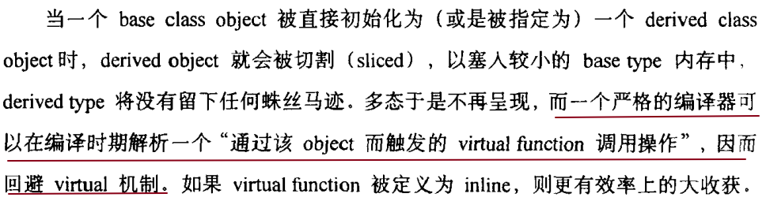
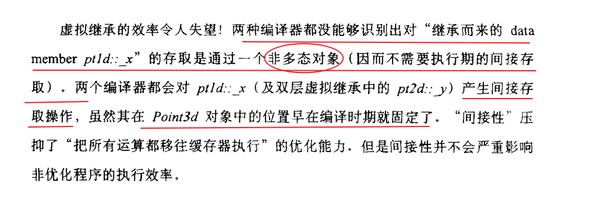

### 第1章 关于对象

- C++中，struct 和 class 在使用上没什么区别，但是从内涵层面（哲学...）讲，struct表示一组结构化的数据，而class怎么表示一个抽象对象，很显然，两者所表示的不是同一东西。

- struct中数据在内存中也是按顺序排布，因此，有一个很有意思的用法，如下：

  ```c++
  struct member {
  	char pc[1];
  };
  strcut member *p = (struct member*)malloc(sizeof(struct member)+string_len);
  //虽然定义的是长度为1的字符数组，但是可以分配更多内存，让它变成一个动态长度的字符数组
  ```

- ~~C++中相同访问域内的数据按照声明顺序排列，在同一块，但是不同访问域的数据顺序则要看编译器。~~

- 如果一块代码无法判断为是表达式还是声明时，会默认将其视为声明，如下：

  ```c++
  int (*pf)(1024); //由于有1024这个整数存在，会被判断为表达式
  int (*pf)();     //这个就只能默认判定为声明
  ```

- 以下内容还无法达到很好的理解：

  

### 第2章 构造函数语意学

- 如果一个class没有任何的constructor，那么当constructor真正需要被用到的时候，编译器会自动合成这么一个default constructor。

  这里需要关注 “真正需要用到的时候” 这一点，

  - 显然的意思就是，你不使用这个class实例化对象那肯定是用不到，也就没必要构造；
  - 其次，就是数据成员（包括继承而来的）中有default constructor（不管是class作者自己定义还是编译器合成的）或者有虚函数（包括继承而来的）又或是继承串中有虚继承，有上述特性的类在默认构造时需要合成default constructor。而除上述之外的class，显然，没必要用构造函数去初始化（class作者自己都不操作，编译器操作图啥呢？
    - 简单解释一下上述，存在含有default constructor的data member，就需要调用它们的default constructor 函数，就需要安排调用代码，因此需要合成；
    - 而对于有虚函数的类，因为对于实例化的对象，指向虚函数表的指针内容一定要真确，也就是必须被初始化，那么就需要特定代码被调用，因此也会合成一份default constrcutor用来安插初始化vptr的代码；
    - 对于有虚父类的类，其内部也存在着一份维护访问虚父类数据的数据（存在意义和vptr虚函数表指针一样，编译器无法知道实际需要访问的数据的偏移量，只能通过间接方式固定访问方式），因此，同有虚函数的类一样，也需要合成一份default constructor

  为防止在不同编译模块合成出多个default constructor，由编译器合成的default constructor（copy constructor、destructor、assignment copy operator同理）都是以inline方式完成，若函数过于复杂不适合用inline实现，那么就会合成一个explicit non-inline static 实体。（TODO::这里默认使用inline实现会不会造成一定代码膨胀，是不是可以理解为，用户自定义更有优势？）

- 对于class作者已经设定有constructor的情况（不管是不是default constructor），编译器都不会再合成default constructor，而是将需要初始化的数据的初始化代码置于所有的constructor的user-code用户代码的上面，初始化顺序按照data member的定义顺序来。

  这里有一点需要注意，**initialization list**其实目的是为了指定需要初始化的data member的初始化参数，并不会影响初始化顺序。

- 有三种情况会以一个object为另一个object的初值而调用copy constructor，如下：

  ```c++
  class A {...}
  A a;
  A x = a;       					//直接赋值
  void f(A t) { ... }
  f(a);          					//作为函数的实参调用
  A g() { A t; ... ; return t; }  //作为函数的返回值
  ```

  上述情况下对copy constructor的调用，由于编译器的优化，可能会导致临时object的产生或者程序代码的蜕变（或者两者都有）

- 如果不存在default copy constructor，编译器合成的思路同default constructor

  default constructor的不合成的操作时啥也不干，而default copy constructor不合成的操作则是bitwise copy

- 在copy structor中使用memset、memcpy的操作时，一定要注意避免修改vptr，因为vptr的初始化代码会由编译器合成置于user-code上面。

- 小知识：在严谨的C++用词中，“定义”是指“占用内存“的行为

- 将一个object作为一个函数的参数时，编译器可能会又两种策略：

  ```c++
  A a;
  f(a);
  ```

  - 第一种，先生成一个临时object，调用copy constructor以传入实参为初始值，然后再函数内操作这个临时object，这个策略还会改变程序的代码形式，会将                                            									`void f(A a) => void f(A &a)`
  - 第二种，直接拷贝构建，对参数实际在函数栈中的位置直接用实参值拷贝构建

- 函数返回一个object时，有一种策略是，为函数`A f()` 添加额外参数 `void f(A& __result)` 也就是将返回操作用引用的形式顶替，在原来的return前调用copy constructor初始化 __result，并且另原来的return不返回值。

- 若对于所有的 `A f()` 都return一个具名数值，那么对于上一条，编译器可以做这样的优化，代码如下：

  ```c++
  A f() {       //原函数
      A t;
      ... //操作
      return t;
  }
  void f(A& __result) {  //编译器改写后操作
      A t;
      ... //操作
      __result.A::A(t);
      return;
  }
  void f(A& __result) {  //施加NRV优化后，显然，少了一次default constructor
      __result.A::A();
      ... //直接操作__result
      return;
  }
  ```

  这里值得注意的是，由于优化的存在，导致程序的执行逻辑会和自己所设想的不一致，例如这一段代码 `A a = f();` 一般都会认为a是由copy constructor初始化而来，然而NRV优化会将其变成如下代码：

  ```c++
  A a;
  f(a);  //void f(A& __result);
         //显然...这里没了copy constructor操作，假若自定义的copy constructor中有什么
         //必须执行到的关键操作，那么这边就会出现问题了，毕竟你会认为copy constructor调用
         //了
  ```

  (TODO::没搞懂为什么使用NRV优化还需要explicit copy constructor? 很奇怪，明明开启NRV优化后省去了一步copy constructor)

- 使用member initialization list最大的好处就是能省去几步操作，至少不使用initialization list进行初始化操作而使用赋值操作的化，至少会多一个赋值操作的调用，可能还会产生一个临时对象之后再destructor。显然，使用member initialization list效率会更高。（还会避免一些奇怪赋值带来的奇怪问题？）

  这里还是得再强调一下，初始化顺序是按照声明顺序来的，基类在先！

- 小小感悟：真的是十分有意思得一节内容啊，感觉对以后构建对象得操作会有帮助，会思考得更细致，不过感觉这更多还是思路，毕竟各家编译器不一样，而且，随着时代进步也会更加不同，当然，最重要的是举一反三嘛！

### 第3章 Data语意学

- 在早期编译器上，对于类内的函数，若函数定义在变量声明前，则有可能造成函数内访问的数据是全局数据而非类内的数据（同名），似乎是类的完整定义完成是在遇到类定义的右括号？类中数据绑定至类有滞后性。因此现在保留了将类中函数完整定义写在类定义之后的习惯。

  当然，除此之外，不管如何，类内的对数据或是名称的其他声明都应放在类定义的最初，用以屏蔽全局的名称。

- C++类内，同访问度的域内数据是按照声明顺序排列，当然，不是紧凑排列，数据与数据之间可能会穿插着一些空白空间——alignment带来的。

- 小知识：static data member 存放在data segment（TODO::这里对各个数据区域不了解）

- 由于static data member会被统一放在data segment，当不同类定义了同名static data member时候，编译器会暗中对每一个static data member编码，以确保它们的唯一性，当然可以反编码回原状（这手法叫：name-mangling，美丽倒是没感觉出来......）

- 类内的函数其实最后都会被编译器加上额外参数，一个指向本体的指针也就是this指针，类中访问类中元素最后都是通过this指针调用（感觉是一种实现手法，因此还可以有其他实现方式）

- 对于一个虚继承的对象指针，通过它访问类内存在于虚父类中的对象时，实际是在执行时才能确定真正的访问对象（或者说偏移量，这一点和调用虚函数其实很像）

- 将一个对象抽象为一个串行继承的时候，需要注意由于 alignment特性 的存在，可能会导致串行继承的对象所占空间远大于原来普通的对象。这里为什么不去优化alignment呢？主要是因为在继承体系中，要固定指向继承体系指针解析其所指内存的解析方式，毕竟，优化过后，对内存的解读方式就要按优化的来了。

- 虚函数的存在会给类带来额外负担

  - 需要维护一个虚表（当然得看编译器得具体实现）
  - 每一个类对象实例都需要维护一个vptr指向虚表
  - constructor也需要更加复杂用来维护vptr
  - destructor也是（当然这个我不是很明白，感觉最多复杂一些，原文得话不是很理解 TODO::）

  补：虚表的第一项一般是对象的运行时类型信息，即RTTI。

- vptr现在一般都是放在类的首端，以前都是放末端，放末端可以让类维持C strcut的访问方式。

  不过vptr放在首端有一个弊端，就是当父类没有虚函数不需要建立虚表，子类有虚函数需要建立虚表，就会有一定额外开销。（？？？编译器需要多加一些判断代码？？？）

- 单一继承的时候，指针的类型转换很简单，指针都是指向同一个内存起始点，但是当多重继承时，由于有多个父类的远古，指向子类的指针转换为指向父类的指针时，需要做一些偏移计算，会有更多消耗。（编译器可以优化，不过仔细想想，这一步的偏移计算无论如何还是需要的吧？所以相对单一继承来说，多重继承指针的转化（还有存取？）会慢一些）

- 对于使用虚拟继承（又或者使用虚函数，也就是使用C++的多态性质），使用者使用到它的时候自然是需要使用到它的多态性质（又或是在空间与效率的平衡上选择了空间更优，不过这不是我接下来想说的并无关系）也就是说，对于使用者来说使用到虚拟继承的时候就是要使用它的多态性质了，因此对于编译器来说，一律按照多态方式解读代码并无太大不妥。原文如下：

  

- 该章最后一节讲了一个指向Data Members的指针，比较有意思。

  使用形式如下:

  ```c++
  class A {
  public :
      int a;
      int b;
  };
  const A::* p1 = 0;
  const A::* p2 = &A::a;  //值为a在A中的偏移量，也就是0，不过以前的编译器似乎都会对其+1
  						//用以区别与p1的区别，也就是一个是null指针，一个是指向类内头
  						//部元素。
  						//不过试了一下MinGW编译器中的实现方式，是将p1的值设为了ff..f
  						//而p2正常为0
  
  A a;
  a.*p2;                  //调用a的a成员
  ```

  值得一提得是，由于这种方式更间接了，因此存取效率也就更差了...横向比较继承体系得存取效率...

- （TODO::”额外的间接性会降低’把所有的处理都搬移到寄存器中执行‘的优化能力“，对这句话不是很能理解）

- 本章能了解到很多关于类内元素（以及各种继承下）的内存布局，一个就是虚函数，一般编译器都会实现一个虚表，这样就能多一个虚表指针，还有一个就是虚继承，会多一个虚类表指针（试了一下VS确实是这样）或者将虚父类指针放入虚函数表中。对构建类以及使用类的时候，考虑效率方面会有很多帮助。

### 第4章 Function语意学

- 小知识：static成员函数后面不能加const

- 类的nonstatic成员函数会由编译器转化，为其加上一个额外的参数，用来接收类的this指针，此时该nonstatic成员函数也就等同于nonmember函数了。  

  这里有个有意思的地方，对于nonstatic member函数，只要使用一个该类的指针就可以调用，也就是说，即使是 ((A*)0)->f() 也行，不需要A对象的实例就可以访问A的nonstatic member函数。

  而对于类内的static成员函数，则会和static nonmember函数一样存储，编译器并不会对其转化。值得注意的是，static成员函数的函数指针类型并非是成员函数指针类型，而是和nonmember一样。自然，其他的member函数的函数指针类型自然是成员函数指针类型。

- 一般类内成员的名称都会经过处理转化成独一无二的名字，毕竟继承的存在可能会产生多个定义重名成员。

- 虽说通过多态性质调用虚函数下，该虚函数本质上不能加上inline，但是对于直接通过object调用虚函数的形式，也就是说并未使用到其多态性质，这种情况下就可以使用inline来扩展。

  从设计的角度讲，虚函数的存在就是为了可以使用多态性，因此其也不存在inline一说，但是从使用的角度讲，虚函数自然也是可以被inline优化的。（~~从某种意义上说，这种情况的虚函数使用是错误的？~~）

- 在多重继承体系下，若存在虚函数，那么对于调用其成员函数就需要做出以下判断：

  - 函数不是虚函数，直接通过函数地址调用函数。

  - 函数非虚函数，通过索引信息间接调用虚表中的函数。此时就会产生一个问题，因为调用成员函数需要传递this指针，那此时需要传递给函数的this指针是哪个？编译器无法得知运行时的信息，那么就需要对象本身本身维护，编译器会为其产生一些额外信息用来修改传递的this指针。

    这里有一个thunk技术，也就是对于需要修改this指针的virtual函数，将其组织为一段代码，也就是先修改this指针，再调用需要调用的virtual函数，虚表中所存的指针就指向这样一段代码。这种技术可以将额外负担只加在需要修改this指针的virtual上。（感觉也不能说技术，像是个编译器自己实现的小技巧？）

  小知识：在多重继承体系下，类中额外虚表个数为n-1，n为该类上一层的父类个数，因此单一继承体系下额外虚表个数为0。

  （因为通过名称符号链接速度可能比较慢，因此可以将原本的具名虚表查询改为通过第一个虚表的偏移值查询？）

- 建议虚拟继承体系中，虚父类不含nonstatic data members，它会导致对成员以及函数的访问负担增加...可能还会出现难以调试的奇怪问题。（Effectiv C++中也有提到，TODO::有空的话可以研究一下。）

- 现代的编译器会将new空间操作和constructor操作分开来，以前的编译器似乎不会？导致constructor会有额外负担，也就是判断当前内存空间是否分配妥当。

- 指向member function的指针，由于虚函数、多重继承、虚继承的存在，member function就需要维护一些偏移信息，用来访问正确的函数，以及传递正确的this指针，这就会带来一定的访问和空间负担。（这一节读来似乎颇有些无味...）

- 要明白，inline只是一项请求，而并非是一个指令，编译器会根据函数的具体情况去评判函数是否需要或者能够使用inline。可以理解为一个优化请求？当然...也可能更加糟糕。

  无法成为inline的函数，会被转化为static函数，放在编译模块内（这就造成可能在不同编译模块内有相同的代码存在，应该是会被清理掉的？）

- 书中有说inline可能会导致大量临时变量的生成，按照我的理解，临时变量产生那应是要产生的，即使不inline也会产生，inline导致最大的问题就是，在同一个表达式中，产生的临时变量会同时存在，这就是个问题。

### 第5章 构造、析构、拷贝语意学

- 抽象类是否需要提供带赋值的构造函数或者其他初始化函数，取决于数据成员的具体含义，抽象不代表啥操作都不应该有。 

  比如抽象出一个容器成员，这个容器成员在这个抽象类的继承体系中，可能就是固定的，那它就需要提供一个初始化函数。

- 不要设想编译器会优化你随意定义的virtual函数，即使你的virtual函数在类的继承体系中表现得和普通成员函数一样。

- 只有明确当前定义的虚函数在之后的继承体系下不会出现修改数据成员的操作，才能将其设为const，否则，就用非const，由子类的设计者加以控制。

- 小知识：在C中，对于一个全局定义未初始化的object，它会被放置在data segment的BSS中。（甚至还能多次定义？而C++则不行。）

- 不要忽略虚表指针所带来的负担。

- 构造流程：

  - 有虚基类，构造虚基类，从左到右，由里到外；
  - 有base class，调用base classes的constructor，顺序和定义顺序一；
  - 有虚函数，初始化vptr；
  - data member会按照声明顺序初始化（有constructor或者出现在member initialization list）

- 虚拟继承会带来构造上的一个问题，就是如果不加限制的按照构造流程处理父类，那么其中的虚父类可能会被构造多次（事实上只要被构造一次就行）。

  编译器一般会加上一个判断，判断当前是否为最子类的构造，只有最子类的构造才会去调用虚基类的构造，但是这也会有一个问题，就是这一个判断操作会带来时间上的负担。

  因此，就有一些编译器，给每一个类构造两个构造函数，一个处理当前是最子类的情况（也就是当前构造函数是在构造函数的调用序列里第一个被调用的），另一个处理中间基类的情况。这样就会省去判断所带来的负担。

- 编译器很难确保copy assignment operator对所有的基类都只操作一次（主要还是在虚继承体系下），虚基类可能会被赋值多次，造成效率上的负担。

  结合上一章虚基类数据成员对this指针偏移所带来的间接访问负担，我们对于虚基类，最好就是不要定义数据成员。（Effective C++中也有说明）

- 一般来说类消亡时不需要维护数据，那就不要给它定义析构函数（在继承体系下最好一个环节都不要）

- 构造的时候类是从基类逐步变成子类（这里指的是静态的变化，不存在多态性），而析构的时候则是反向退化，从子类蜕化为基类，最终消亡。

- 这一章吧....一言难尽，初看云里雾里，再看感觉就是对前几章知识的强化？或者说是查漏补缺？知识点如果前几章细看的话，这一章就没有太大难度，不过可能其想表述的内在含义我没有体会到...

**第6章 执行期语意学**

- 
