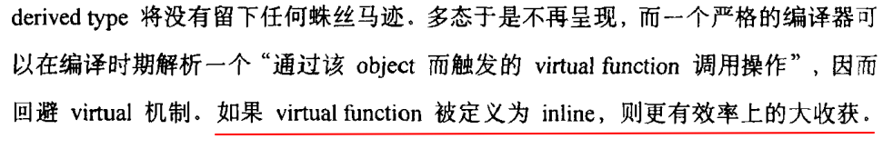
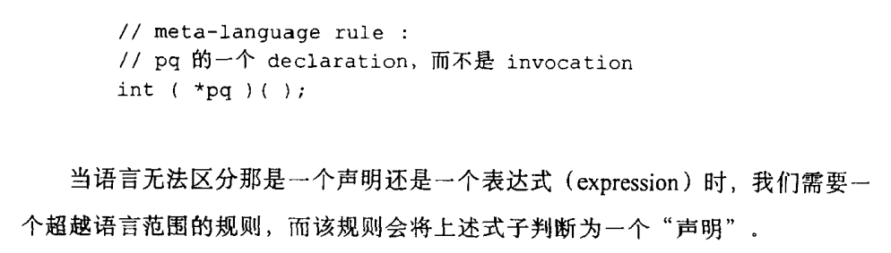
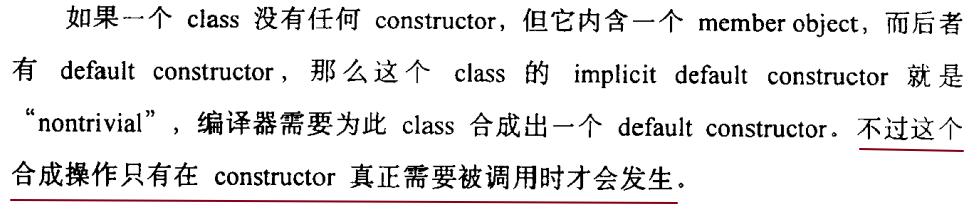

### 阅读暂存

#### 第一章







#### 第二章




### 第1章 关于对象

- C++中，struct 和 class 在使用上没什么区别，但是从内涵层面（哲学...）讲，struct表示一组结构化的数据，而class怎么表示一个抽象对象，很显然，两者所表示的不是同一东西。

- struct中数据在内存中也是按顺序排布，因此，有一个很有意思的用法，如下：

  ```c++
  struct member {
  	char pc[1];
  };
  strcut member *p = (struct member*)malloc(sizeof(struct member)+string_len);
  //虽然定义的是长度为1的字符数组，但是可以分配更多内存，让它变成一个动态长度的字符数组
  ```

- ~~C++中相同访问域内的数据按照声明顺序排列，在同一块，但是不同访问域的数据顺序则要看编译器。~~

- 如果一块代码无法判断为是表达式还是声明时，会默认将其视为声明，如下：

  ```c++
  int (*pf)(1024); //由于有1024这个整数存在，会被判断为表达式
  int (*pf)();     //这个就只能默认判定为声明
  ```

- 以下内容还无法达到很好的理解：

  

### 第2章 构造函数语意学

- 
