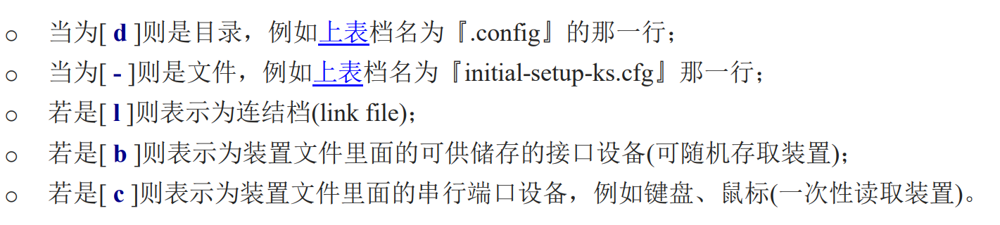

## 文件相关：

​	**文件权限**：用户对文件/目录拥有的权限共有3个，即可读(r)、可写(w)、可执行(x)。

​		对***文件***来说，

​			'r'权限表明是否可以浏览文件的内容，

​			'w'权限表明是否可以修改文件内容，

​			'x'权限表明是否可以执行该文件(例如linux中的一个可执行程序需要执行的话，执行它的用户必须要有'x'权限)；

​		对***目录***来说，

​			'r'权限表明是否可以浏览该目录的内容(若没有对目录的可读权限，那么ls将失效)，

​			'w'权限表明是否可以创建或者删除目录中的文件，

​			'x'表明是否可以打开该目录。

​	**文件类型**：

对于ls出来的文件描述，第一列会有如"drwxr--r--"的描述。对于“drwxr--r--"字符串，共有10个字符，第1个字符表示文件的类型，234表示文件拥有者的权限，567表示用户组的权限，8910表示其他用户的权限。 'r'=4表示文件可读，'w'=2表示可操作，'x'=1表示可执行 

​	使用chmod可以修改用户对指定文件的权限；chgrp可以修改文件的所属组；chown可以修改文件的所属者。

​	文件名最长为255bytes

​	Linux目录配置依据FHS标准，根目录中的每个文件夹都具有相对于系统来说的指定存储对象，一般根目录不建议放用户文件。从FHS的定义中，可以得到一些有用的操作，比如将/var文件夹独立存储，使得系统运行数据和用户数据分离，当系统崩溃时也能救援出用户数据。

​	

