很多读者都会误会/usr 为 user 的缩写，其实 usr 是 Unix Software Resource 的缩写， 也就是『Unix 操作系统软件资源』所放置的目录，而不是用户的数据啦！

挑战 FHS 官方英文文件

#### 第6章

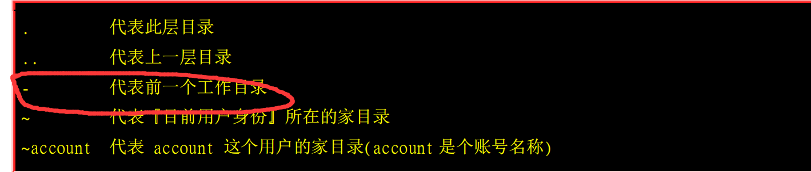

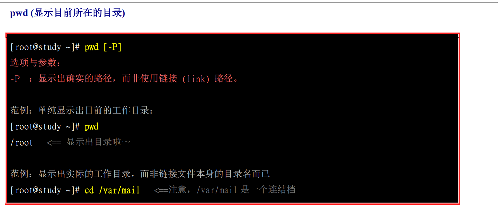

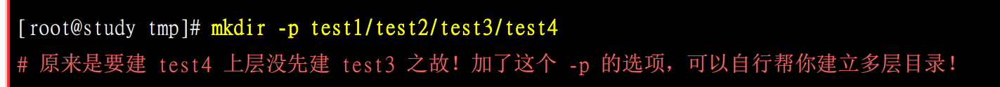

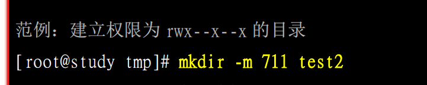

ll == ls -l  在ubuntu18.04中实测不太一样

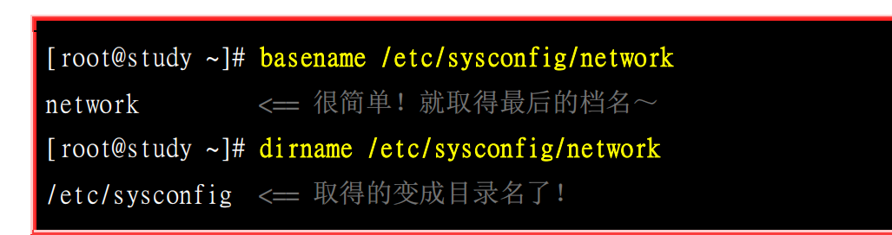

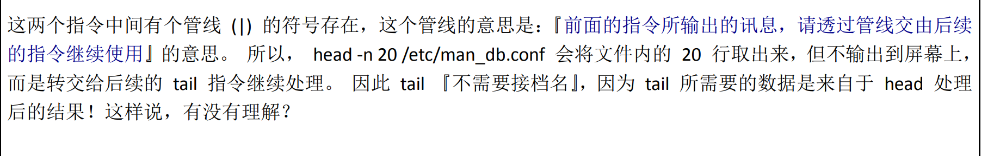

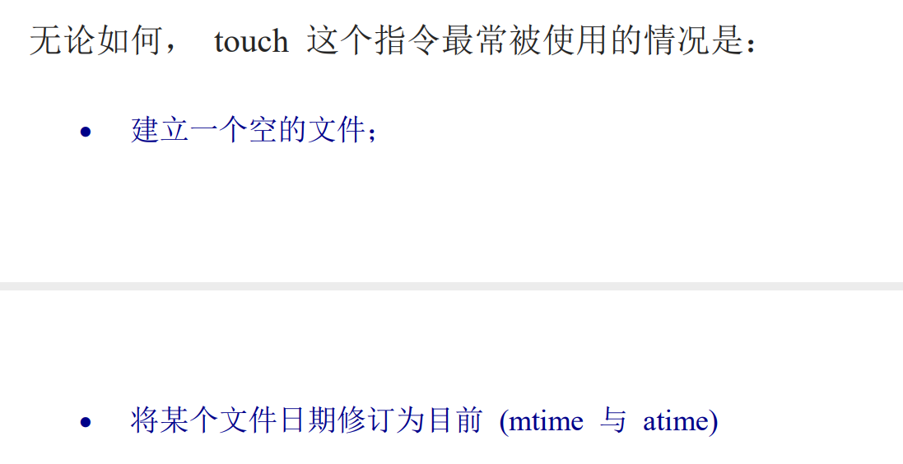

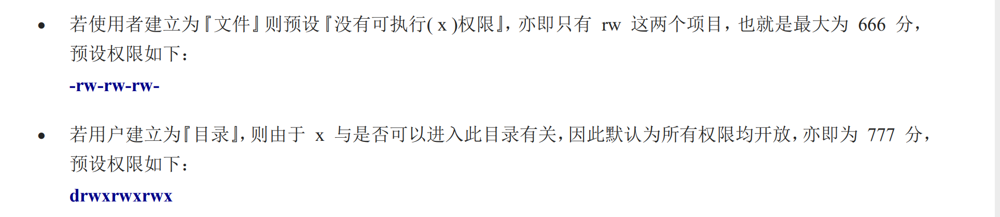

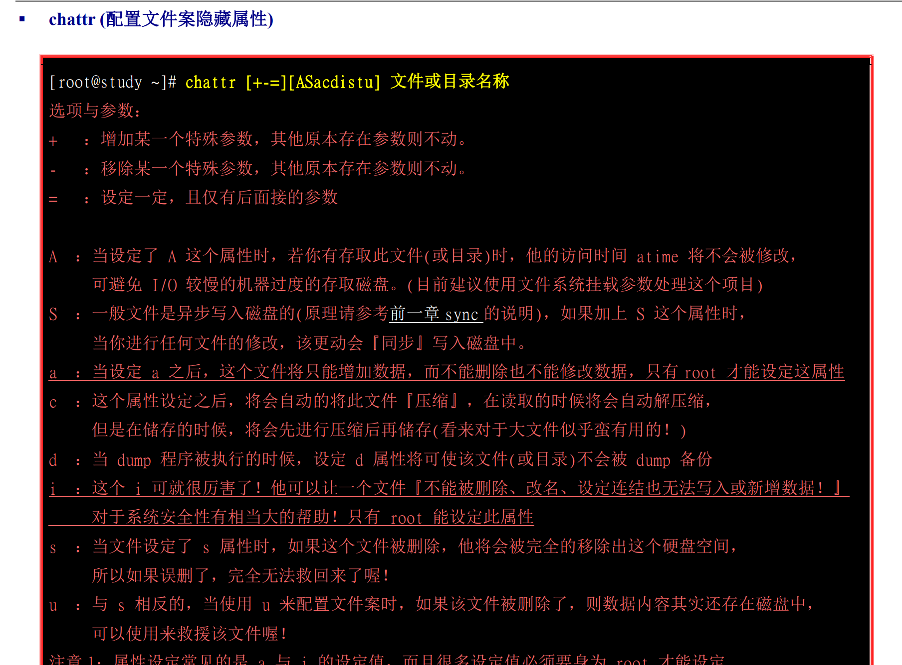

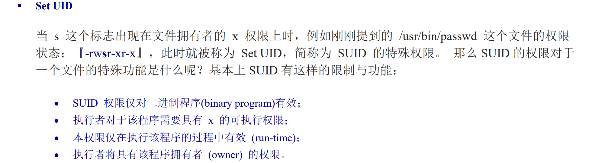

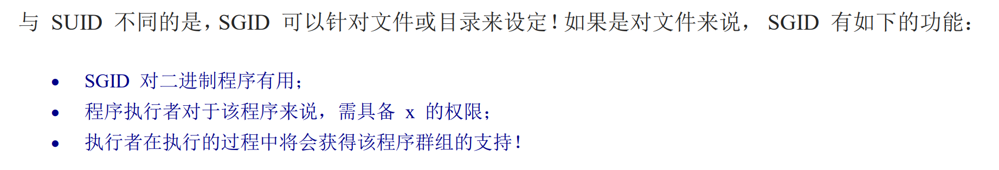

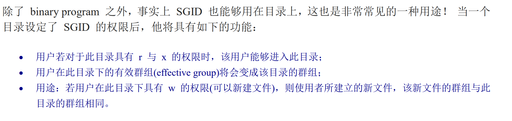

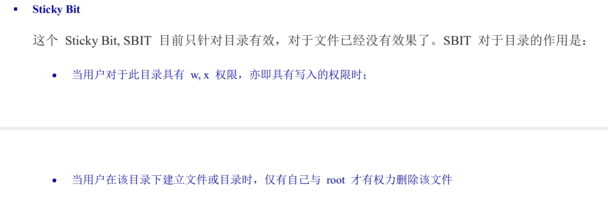

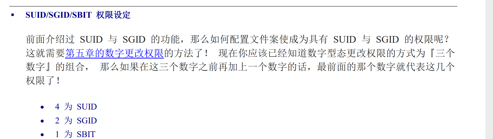

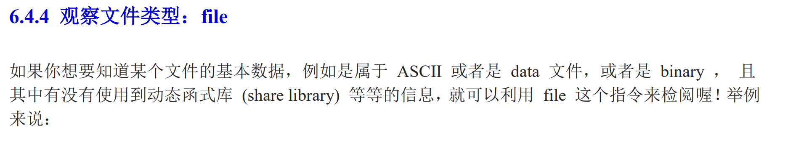

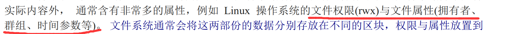

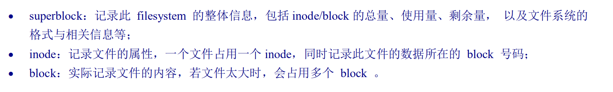

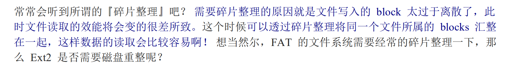

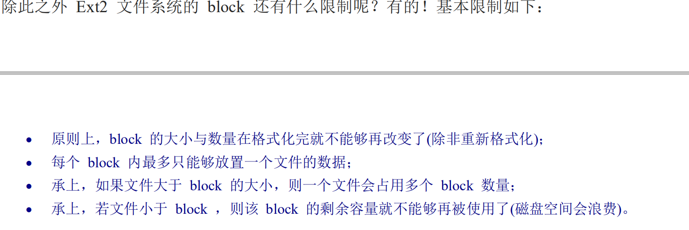

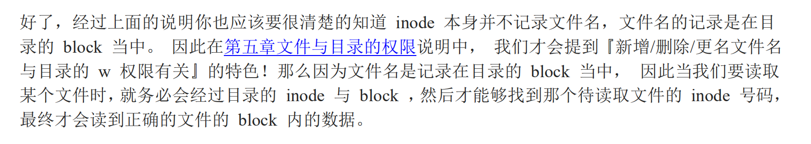

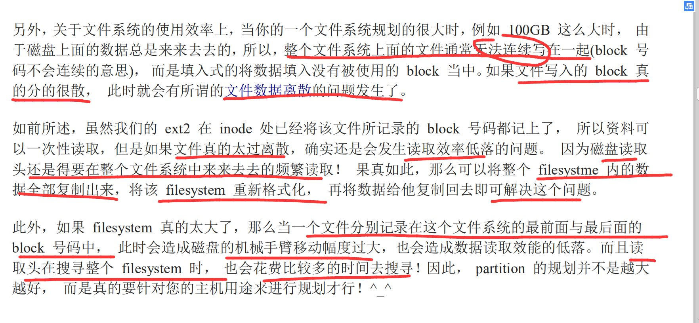

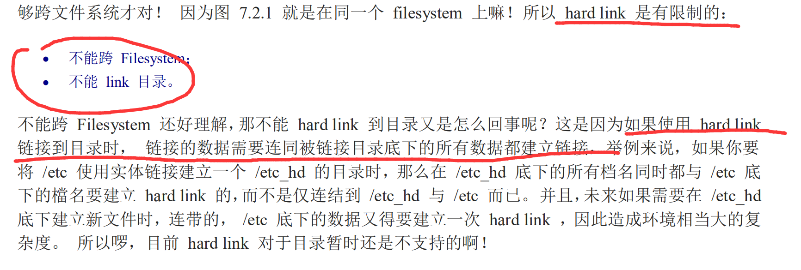

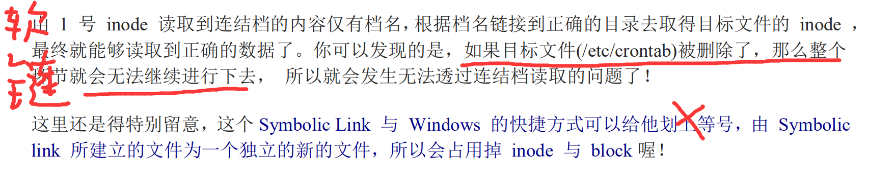

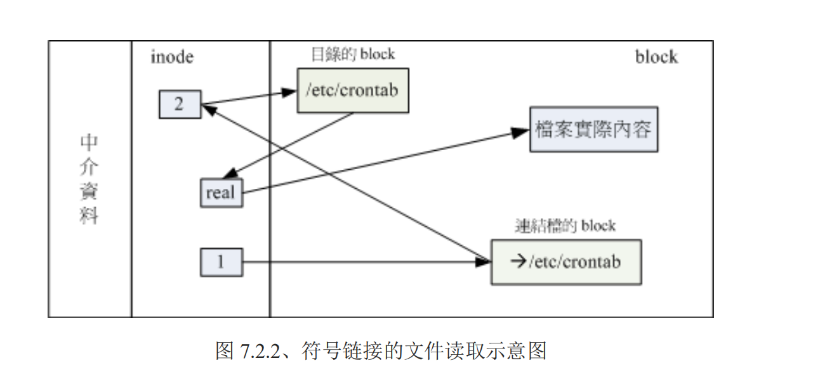

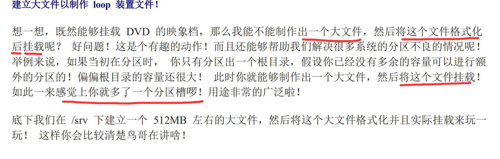

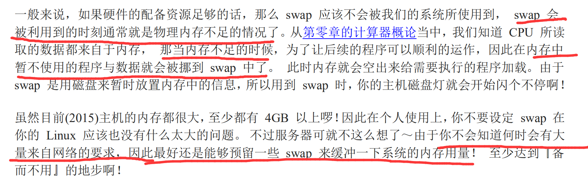