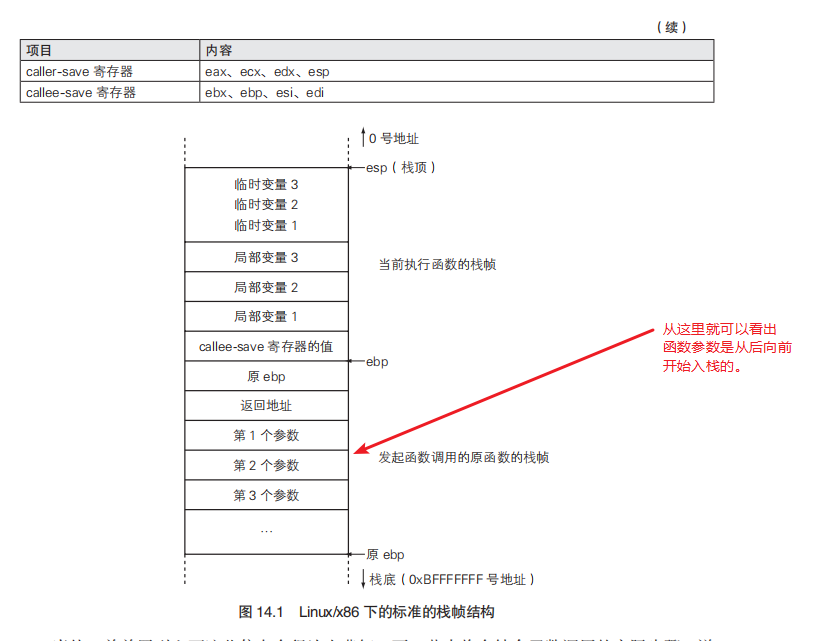
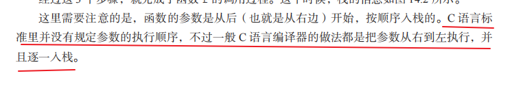
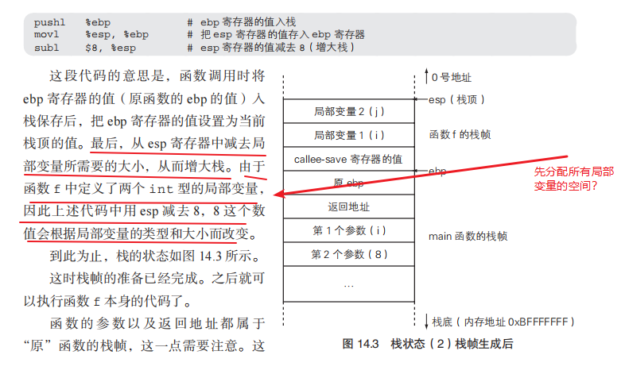
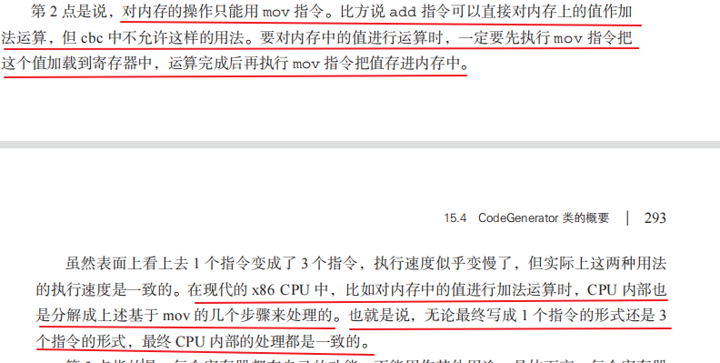
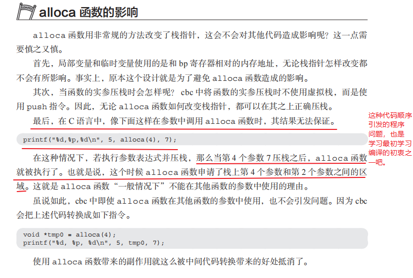
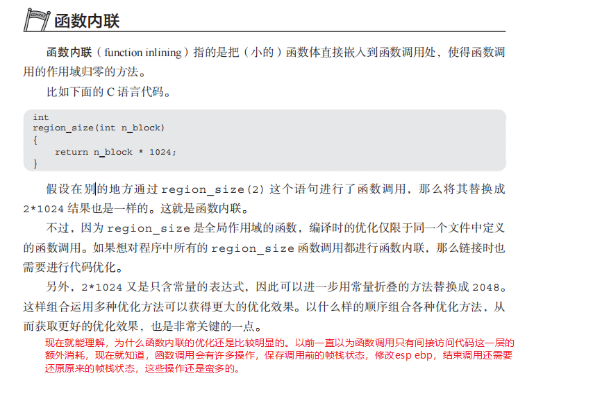
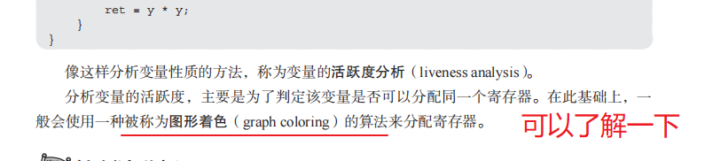
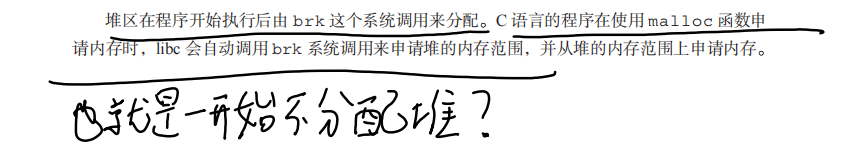
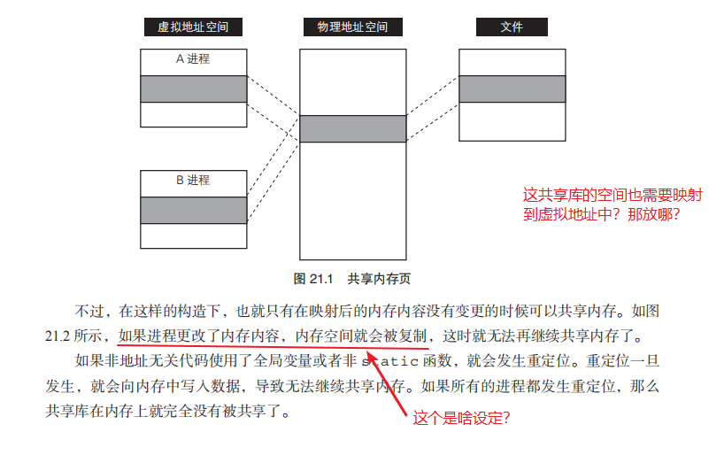

### 第9章 语意分析（1）引用的消解

- P144

  

### 第10章 语义分析（2）静态类型检查

- P166

  

### 第12章 x86架构的概要

- 

### 第14章 函数和变量

- P268

  

- P269

  

- P270

  

### 第15章 编译表达式和语句

- P292

  

### 第16章 分配栈帧

- P331

  

### 第17章 优化的方法

- p336

  

- p341

  

- p342

  

### 第20章 加载程序

- P392

  

### 第21章地址无关代码

- P411

  

- 
