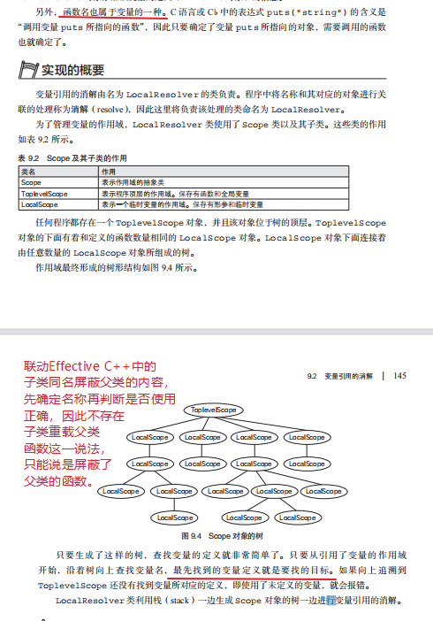

**写在前头**：*读这本书的目的是为了让自己能够简略的知晓编译相关知识，相当于入个门，不求理解有多深，关键是对编译原理相关的知识体系有个大致的框架。（直接看龙书难度还是过大，希望借这本书比较好的搭一个知识框架）*

### 第1章 开始制作编译器

- gcc将hello.c转换为可执行文件的流程，一般的 *编译*  为以下流程的总和，但真正意义上的编译还是指 第二步 的狭义的编译。
  - 1、预处理
  - 2、（狭义的）编译
    
    - 语法分析（这里准确来说应该是要分出一个 *词法分析* ）
    
      - 语法分析简单来说就是将编程语言结构化的过程（一般是结构化成语法树）。
    
        我的理解就是转化分隔符为树中的结构关系，并提取出符号、标识符等。
    
    - 语义分析
    
      - 大概就是分析变量（表达式、一些符号等的）具体属性（局部还是非局部、是否为引用、类型等），然后检查结构化后的流程是否满足当前结构的要求，补充一定流程（如一定的类型转换）。
    
    - 生成中间代码
    
      - 生成中间代码的目的是为了让前后端分离，即前端专注于语言，与机器无关，而后端专注于机器，只关注中间代码和机器代码之间的映射关系。减少了不必要的重复翻译过程。
    
    - 代码生成
    
      - 将中间代码转化为汇编代码
  - 3、汇编
  - 4、链接
- *编译器* 是将语言转化为可执行的形式，而 *解释器* 可以直接运行代码（Python这种就是解释型语言）。

### 第2章 C**♭**和cbc

- 主要是简单说明了一下C**♭**语言相对于C语言来说不同的部分，

  介绍了一下cbc的包结构，几个出入流程函数。

### 第3章 语法分析概要

- 词法分析 大致是将代码中所有的独立的词都分割提取出来，这是理论上此法分析只需要做的。

  完成词法分析任务的模块叫词法分析器或扫描器。词法分析器不仅仅完成分词任务，还有分析词义的任务（单词+种类+语义值）。

  在编程语言处理系统中，将 一个词+它的种类+语义值 统称为 token。

- 介绍JavaCC生成解析器的功能

### 第4章 词法分析

- 讲述了JavaCC词法分析的规则，本质是基于正则表达式提取所有token。

### 第5章 基于JavaCC的解析器的描述

- 讲述了JavaCC的语法描述规则（基于EBNF）。和正则表达式的表示方式类似。
- 语法树的叶子节点可以称之为终端符，非终端符一定位于语法树中的分叉处。

### 第6章 语法分析

- 介绍了在JavaCC中各种基础语法的描述方法。

### 第9章 语义分析（1）引用的消解

- 

  梦幻联动...

- 

  从这边就能理解，很多时候解决编译器的代码报错需要从头开始处理，否则可能都无法理解中间的错误为何产生。
