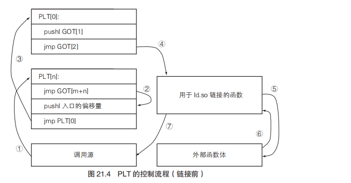
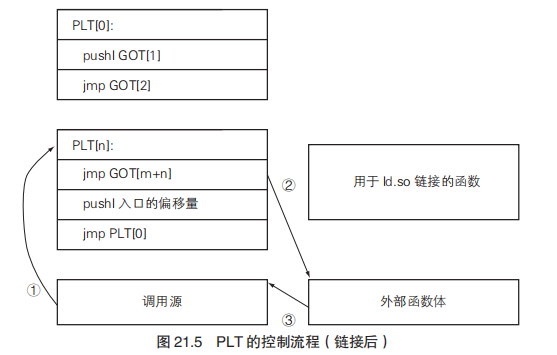

**写在前头**：*读这本书的目的是为了让自己能够简略的知晓编译相关知识，相当于入个门，不求理解有多深，关键是对编译原理相关的知识体系有个大致的框架。（直接看龙书难度还是过大，希望借这本书比较好的搭一个知识框架）*

### 第1章 开始制作编译器

- gcc将hello.c转换为可执行文件的流程，一般的 *编译*  为以下流程的总和，但真正意义上的编译还是指 第二步 的狭义的编译。
  - 1、预处理
  - 2、（狭义的）编译
    
    - 语法分析（这里准确来说应该是要分出一个 *词法分析* ）
    
      - 语法分析简单来说就是将编程语言结构化的过程（一般是结构化成语法树）。
    
        我的理解就是转化分隔符为树中的结构关系，并提取出符号、标识符等。
    
    - 语义分析
    
      - 大概就是分析变量（表达式、一些符号等的）具体属性（局部还是非局部、是否为引用、类型等），然后检查结构化后的流程是否满足当前结构的要求，补充一定流程（如一定的类型转换）。
    
    - 生成中间代码
    
      - 生成中间代码的目的是为了让前后端分离，即前端专注于语言，与机器无关，而后端专注于机器，只关注中间代码和机器代码之间的映射关系。减少了不必要的重复翻译过程。
    
    - 代码生成
    
      - 将中间代码转化为汇编代码
  - 3、汇编
  - 4、链接
- *编译器* 是将语言转化为可执行的形式，而 *解释器* 可以直接运行代码（Python这种就是解释型语言）。

### 第2章 C**♭**和cbc

- 主要是简单说明了一下C**♭**语言相对于C语言来说不同的部分，

  介绍了一下cbc的包结构，几个出入流程函数。

### 第3章 语法分析概要

- 词法分析 大致是将代码中所有的独立的词都分割提取出来，这是理论上此法分析只需要做的。

  完成词法分析任务的模块叫词法分析器或扫描器。词法分析器不仅仅完成分词任务，还有分析词义的任务（单词+种类+语义值）。

  在编程语言处理系统中，将 一个词+它的种类+语义值 统称为 token。

- 介绍JavaCC生成解析器的功能

### 第4章 词法分析

- 讲述了JavaCC词法分析的规则，本质是基于正则表达式提取所有token。

### 第5章 基于JavaCC的解析器的描述

- 讲述了JavaCC的语法描述规则（基于EBNF）。和正则表达式的表示方式类似。
- 语法树的叶子节点可以称之为终端符，非终端符一定位于语法树中的分叉处。

### 第6章 语法分析

- 介绍了在JavaCC中各种基础语法的描述方法。

### 第7章 JavaCC的action和抽象语法树

- 介绍了JavaCC在匹配token过程中时如何使用action进行自定义操作

### 第8章 抽象语法树的生成

- 介绍了JavaCC如何在匹配token过程中返回token对应的Node来构建抽象语法树，相对来说并没有特别难理解的地方，返回token对应的Node即可。

### 第9章 语义分析（1）引用的消解

- 介绍了语义分析的整体内容

  - 变量引用的消解
  - 类型名称的消解
  - 类型定义检查
  - 表达式的有效性检查
  - 静态类型检查

  然后介绍了引用消解和类型名称消解，这部分内容简单理解就是将所有的名称和定义实体关联起来，使得所有的名称都指向各自最近定义域内的同一实体上。

  当然都是基于如何在JavaCC中实现。

### 第10章 语义分析（2） 静态类型检查

- 不得不说这节很有意思的一个小知识，就是在C/C++中，函数名表示函数变量表示函数指针，然后有意思的就来了

  ​	`void func(){};   ==>  func == *func == **func == ***func == ... == &func`

- 本章主要介绍了如何对定义的有效性（这个比较吸引我的是利用有向图来表示定义的依赖关系，从而可以判断出环引用）、表达式的正确性以及静态类型检查（静态类型检查是自底向上的类型检查方式，而类型推导则是自顶向下的方式）的在JavaCC中的实现逻辑。

### 第11章 中间代码的转换

- 中间代码的意义是为了使语言的表现更加抽象？精简逻辑？然后针对不同的优化方向（比如想要优化逻辑结构、优化最后生成机器语言后的代码效率等）生成不同侧重点的中间代码，然后再针对优化。

  感觉中间代码就是抽象了另一端代码需要优化的点所形成的，如果是由被翻译端的代码主导，感觉就是整理逻辑简单过渡了。

  （TODO::感觉表述有些模糊，之后多看些相关书再来补充好了）

- 本章么主要就是讲了在JavaCC中对各种表达式生成中间代码的逻辑。

  瞅了瞅，就是在扁平化代码（不过整体还是树形结构）使得更接近汇编代码的调用逻辑。

- TODO::这章应该还有个左值右值值得关注。

### 第12章 x86架构的概要（PS:浅尝辄止的计组知识）

- 由于要将上述的中间代码转换为机器语言，那么就需要对计算机系统有一定了解才行，本章简要介绍了计算机系统的基本架构：

  - **物理地址和虚拟地址**：对于每一个进程来说，都有自己的一块独立虚拟地址空间，可以理解为一块虚拟的干净的连续的从0开始的地址空间。然后通过中间层，将访问虚拟地址的操作转换为访问实际的物理地址（CPU内部的MMU会将虚拟地址转换为物理地址）。这里还有一些OS中*页*管理的一些知识可以继续学习。

  - **缓存**：由于cpu的处理速度远远快于访问存储器的速度，因此将需要频繁访问的数据存入高速缓存中是一个比较有效的操作，而且一般程序执行时也确实是对一定数据频繁访问（为什么不将存储器都换为高速存储器呢？因为贵啊）。

    ​			由于现在CPU与存储器速度的差异越来越大，因此就产生了多级缓存机制，也就是L1 cache、L2 cache...

  - **32位/64位**：一般的将寄存器大小为32位的CPU称为32位CPU，64位同理。

  - **指令集架构**：简单理解就是CPU所能使用的指令集集合吧，使用相同指令集的CPU就能同样的执行一个程序（照我理解，可能指令的实现不同，但是效果是一样的，也就是说，流程和输出应是一模一样的）。

  - **IA-32的寄存器**：简要描述一下目前熟悉的吧，主要还是可以触类旁通

    - 通用寄存器：其中esp和ebp虽然是通用寄存器，不过用途一般是固定的，esp存的是指向帧栈的栈顶的地址，ebp是帧栈的底的地址。
    - 指令寄存器（eip）：存储下一条需要执行的指令代码的地址。
    - 标志寄存器
    - 浮点数寄存器
    - MMX寄存器

  - **机器栈**：用以存放一些临时数据（或者保存当前其他寄存器的状态？因为可能当前的运算需要使用多个寄存器但当前寄存器存有数据）。机器栈是由多个帧栈所组成的，帧栈可以对应为C语言中一个函数使用的空间。

  - **指令指针**：即指令寄存器，又可以称为程序计数器。

  - **标志寄存器**：当前只会用到*状态标志*。

    - 1、表示运算结果的 *状态标志*
    - 2、用于控制运算的 *控制标志*
    - 3、用于控制计算机整体运行的 *系统标志*

  - **字节序**：对于一个数据，假设为int，用abcdefgh表示其各位字节，在存储地址中，若按从地址0（小地址）开始到n（大地址），按序存储a、b、c...那么称为大端序，这种存储方式和我们日常书写认知的顺序相同比较自然，因此大端也被称为*网络字节序*；反之就是小端序。

  - **对齐**：为了提升数据的读取速率，降低一些错误。一般会要求数据的地址是数据大小的倍数，也就是说，2字节的数据需要放在数值是2得倍数的地址上，4字节的数据需要放在数值是4的倍数的地址上...

    ​			对于结构体来说，就会按照此规则填充一些额外的空间，同时，结构体的总大小也是最长数据成员长度的倍数。

### 第13章 x86汇编器编程

- 这章主要是介绍了基于GNU as汇编器的汇编语法。

  可以简单说一下比较特殊的地方：和windwos上熟悉的MASM汇编有所不同，GNU as中，例如mov、add..等助记符后都要跟b、w、l、q用来表示操作数的位数，同时，类似于mov，在GNU as中是mov 源 目标，和MASM相反。

### 第14章 函数和变量

- 不同的CPU和OS会有不同的程序约定。

  程序约定简单来说就是描述一个函数的调用流程，当前的程序状态如何保存以及如何恢复。

- 本章主要是介绍了Linux/x86下的程序调用约定。流程如下：

  1. 在调用端帧栈push函数参数，一般是从右向左入栈；
  2. 在调用端帧栈push返回地址，即被调用函数结束时需要执行的指令地址；
  3. 在调用端帧栈push ebp寄存器的值，也就是保存调用端帧栈的栈底；
  4. 建立被调用端帧栈，直接预留被调用端的局部变量空间（应该是先保存callee-save寄存器的值）；
  5. 执行被调用端的指令
  6. 函数执行完毕，寄存器通过保存的信息还原回调用前的状态，若是函数有返回值，一般存放在eax寄存器中，至此，程序调用结束。

### 第15章 编译表达式和语句

- 讲述了cbc翻译表达式和语句（中间代码）为汇编代码的逻辑和流程
- TODO::想来，这本书应该是分为理论讲解和实践操作两部分的，读完后可以整理一下，目前位置对于实现逻辑的讲解都是流水账式扫过，只做了少数简要思考。

### 第16章 分配栈帧

- 

- cbc中的原则是减少栈指针（esp）的修改次数，因此很多空间都是提前开好，看着像是以空间换时间？  (TODO::不知道其他语言编译的时候是个啥样，比如C++)
- cbc中子作用域是共用一块局部变量空间，这个节省空间的操作倒是很好理解，按序访问的同级子作用域，访问后一个时，前一个子作用域就已经无效了。
- alloca函数对我来说算是比较眼前一亮的一个函数吧，在栈空间上开辟空间，就是将malloc的作用域从全局堆转到了函数栈上，因此使用alloca所开的空间会在函数退出时销毁。蛮有意思。
- 本章主要还是在讲cbc将函数（中间代码）转换为汇编代码的流程和逻辑。

### 第17章 优化的方法

- 编译优化有几个广为人知的优化方法：
  - 常量折叠：就是将多个常量计算表达式在编译阶段就计算出来，减少运行时的计算；
  - 代数简化：简化表达式，类似于`x*1 => x`，和常量折叠本质相同，简化运行时的计算；
  - 降低运算强度：对于计算机来说，`x*4`的计算要慢于`x<<2`的计算速度；
  - 削除共同子表达式：如同字面意思，重复计算同一个无变化表达式的值是没啥用的，因此可以优化成只计算一次；
  - 消除无效语句：类似于`if(0) ...`这种语句；
  - 函数内联：从上几章的内容可以知道，函数调用需要许多额外的操作，因此对于简短的函数调用，实际上直接使用函数内容进行运算会比间接调用函数来得高效，尤其是频繁调用的简短函数。
- 这里又出现了 *中间代码* 那一章对优化的思考，其实编译本身就是一步一步得（不一定是递进？）整理表达结构，最后输出所需要得语言，中间每一步所整理得代码，除了便于递进之外，还应有针对某个方面利于优化得特点，比如整体逻辑结构、数据流走向、指令逻辑简化等（这几个例子随口胡诌）。
- 更深层的优化简述：
  - 基于模式匹配选择指令：针对某一种模式的表达式运用特定的指令逻辑，而非通用指令逻辑；
  - 分配寄存器：对于非同时活着（在一个简要表达式中同时出现且具有串行关系？书中没有具体定义只能盲猜一波）的变量，可以分配同一个寄存器。 像这样分析变量性质的方法可以称为*活跃度分析*。 可以通过图形着色算法（将同时活着的变量连边，相互连接着的变量不同色？）来完成活跃度分析后的寄存器分配。
  - 大规模的数据流分析和SSA形式：SSA形式就是保证每一个名称对应一个固定值，也就是对于一个变量，每次修改值后，都赋予一个新的名称，这样的话程序代码中每一个名称都是定值。这样就利于各种分析优化，比如削除子表达式这种操作。
- 本章的优化说明主要还是起一个抛砖引玉的作用，触类旁通，举一反三。

### 第18章 生成目标文件

- 这章主要感觉很多知识似乎没能很好的串联起来，读完之后有所收获但在脑子里不能有一个连贯的知识链，甚至有很多有疑问的地方。（比如生成的目标文件具体是什么玩意儿，是我之前看的不仔细吗？）

  还是需要对生成汇编代码及之后的流程有一定了解之后才会有更好的理解（尤其是程序是怎么被运行加载的？）

  TODO::等这一部分的内容全部了解之后，再回头来看再总结。
  
- LInux中使用**ELF文件结构**来描述目标文件、可执行文件以及共享库的所有信息，按我的理解，ELF文件结构就是在描述一段可执行程序在一块空间（一般是内存）中的布局及各个元素的属性信息。

- 由于生成汇编代码之后的下一阶段就是生成目标文件，本章就是通过引出ELF文件结构（目标文件的文件结构就是ELF）的介绍，来讲述如何使用汇编代码生成ELF文件结构所需要的信息。

  上几章都是在针对用户具体代码讲解如合生成汇编代码，可以说是在讲代码流程的汇编代码；而这一章，就是在讲程序内存布局的汇编代码。 

### 第19章 链接和库

- 首先需要明白什么是**链接**：

  链接的输入对象是目标文件（准确定义是 *可重定位文件*）、静态库、动态库，输出对象为可执行文件、共享库（还有依旧生成目标文件的功能，称为部分链接，想来是为了统一多个库表文件，一般使用频率不高所以只在备注中叙述）；

  链接概括性的说，就是在合并多个目标文件（又或者说多个描述程序内存布局的文件）为一个，这里的合并主要是在处理内存布局；除此之外另一个比较主要的功能就是消解未定义符号（比如之前只保存了调用外部函数的名称，现在需要将其变成具体的调用方式，差不多是一个占坑符变成真正可以使用的指针的意思吧）。除此之外自然还有许多细节功能就不多赘述。

- 链接可以分为**动态链接**和**静态链接**（感觉是按如何处理未定义符号的性质分的）

  - 动态链接：

    链接未定义符号实体的操作在程序运行时进行，而非在编译程序链接阶段，编译程序链接阶段只检查符号在动态库（已经编译好的专未动态链接使用的符号集，函数、变量以及各种定义）中是否存在。

    动态链接的优势在于：

    1. 减小了程序体的体积（减小了磁盘空间消耗）

       毕竟各种调用依赖了动态库，自身就不需要很多代码，相对于静态编译来说，也不需要将库中的需要的代码段复制过来。

    2. 方便替换

       也就是在接口不变的情况下，只需要修改库中代码就可以完成功能的修改，而不需要修改原程序。

    3. 减小了内存消耗

       动态链接的程序在执行时需要链接动态库，而此时动态库只要在内存中存在一份即可，对于只读的`.text`段内容，可以共享给多个程序使用。

    缺点：

    1. 当然动态链接这种间接访问符号内容的方式，自然会降低程序的效率，不过一般对效率影响很低；
    2. 同时，由于对动态库的依赖，当将程序移动到另外的环境中运行时，若缺少某个共享库，就会导致程序的运行错误，若动态库的版本控制没有做好，那就可能造成无法确定的程序运行状态。

  - 静态链接：

    有了动态链接的描述，静态链接就很容易理解了。静态链接就是在编译程序链接阶段，将未定义符号所对应的静态库中的内容复制过来。

    在我的理解下，静态链接最大的好处就是程序运行不用依赖于环境中的共享库了吧。

- 动态库的名称这部分，想来只有soname对应程序加载时链接所需要查找的名字这一内容需要记一下，还有多个名称一般都指向同一个文件，也就是动态库实体只有一份。

### 第20章 加载程序

- 首先ELF文件中包括了程序被加载入内存空间后的内存布局描述，其实，可以将ELF中的绝大部分内容理解为程序在内存中的布局在文件中的映射，例如`.text`段，ELF文件中的`.text`段是可以直接挪到对应内存中的（当然会有些偏移，虚拟内存地址不会和ELF文件完全一致，主要是因为内存页大小固定原因）。

  Linux中进程的内存镜像会被保存在文件中，这玩意儿可以视为ELF文件结构的豪华升级版？

  然后对于不同的段所映射的内存空间，会有不同的属性，分为 可读、可写、可执行、是否共享。

  注意 .bss段、机器栈、堆 的内存空间和ELF文件不对应

  1. .bss段在ELF文件中就没有对应的实际内容，只有大小和对齐描述，.bss段的空间是需要通过mmap申请。

  2. 机器栈的内存空间是由Linux内核在程序启动时分配，一般在内存地址空间末尾附近。

  3. 堆的内存空间一般是给malloc用的；

     堆的内存空间一般是放在程序内存空间的后面；

     堆的内存空间是在程序开始执行后由brk这个系统调用分配的，C语言在使用malloc后会去调用brk申请堆内存并且在堆上分配空间（这个堆的内存空间在有malloc执行后才会分配有待调查TODO）。

- 这一条来理一下从程序加载到执行结束的流程吧：

  1. 加载程序到内存空间
  2. 链接共享库
     1. 调用ld.so加载所选要的共享库
     2. 重定位和符号消解（准确说是处理，因为真正的消解可以延迟到真正的执行时）
  3. 初始化所有ELF文件（.init和.init_array）
  4. 通过AUX变量跳转程序函数进入点开始执行程序（这里要注意一点，进入点的函数一般是_start而不是main）
  5. 执行ELF文件中的程序结束代码（.fini和.fini_array）

- **动态加载**是在程序运行时通过函数调用来加载共享库的方式，调用共享库内容的方式么理论上肯定时基于指针直接指向内存中共享库的内容

  （嘿，突然有个问题，这里一般定义指针都是在访问当前进程内的虚拟地址空间，共享库除非是被加载到当前的进程空间中，否则该如何访问？TODO）

- 本章主要是梳理了加载程序到运行结束的流程，着重于加载程序和链接共享库这两阶段。

### 第21章 生成地址无关代码

- 共享库可以在内存中只保存一份，其他所有的进程可以共享该块内存来访问共享库，实际使用时是将共享库的地址空间映射到本进程的虚拟地址空间中。

  因此很容易理解，共享库中的代码都需要通过相对地址来访问变量，因为共享库被映射到不同进程中的地址位置不同，若使用绝对地址，那肯定会访问错误，所以需要通过相对地址访问。

- 利用GOT（全局偏移表）可以实现地址无关代码的变量访问部分，这玩意儿应该是存了所有变量相对于GOT的相对偏移量

- 利用PLT（过程链接表）可以实现地址无关代码的外部函数调用，PLT表会利用GOT表实现初始化和函数的访问。

  这里需要关注一点的就是，因为PLT表的入口可能很多，所以一个外部函数在PLT表中的对应项一般是在第一次调用时初始化。初始化时会利用GOT表跳转到ld.so利用ld.so的代码去搜索外部函数的实际地址。

  

  

- 显然，也可以生成地址无关程序，提高程序的安全性？为什么不直接都生成地址无关的代码，想来是地址无关代码的访问模式会带来一定的效率影响吧。
- 本章最主要是在讲如何通过GOT和PLT将程序代码转换为地址无关代码。

### 总结

- 过一遍总的流程吧
  1. 词法分析
  2. 语法分析
  3. 语义分析
  4. 中间代码
  5. 汇编代码
  6. 目标文件
  7. 链接 --->> 至此可执行程序生成完毕
  8. 加载
  9. 链接共享库
  10. 利用.init、.init_array段初始化所有ELF文件
  11. 执行程序主体代码
  12. 执行退出处理代码（.fini、.fini_array）--->> 至此程序执行完毕