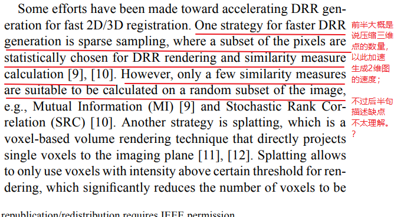

手术前的3D数据，手术中的2D数据，根据手术中的2D数据匹配3D数据来定位当前位置。

“small capture range”指什么？

“because the similarity measures to be optimized in intensity-based methods are often highly non-convex, the optimizer has a high chance of getting trapped into local maxima, which leads to a small capture range of these methods”  优化方式非凸 是什么意思？ 为什么导致局部最优？ 又为什么导致捕获范围小？

